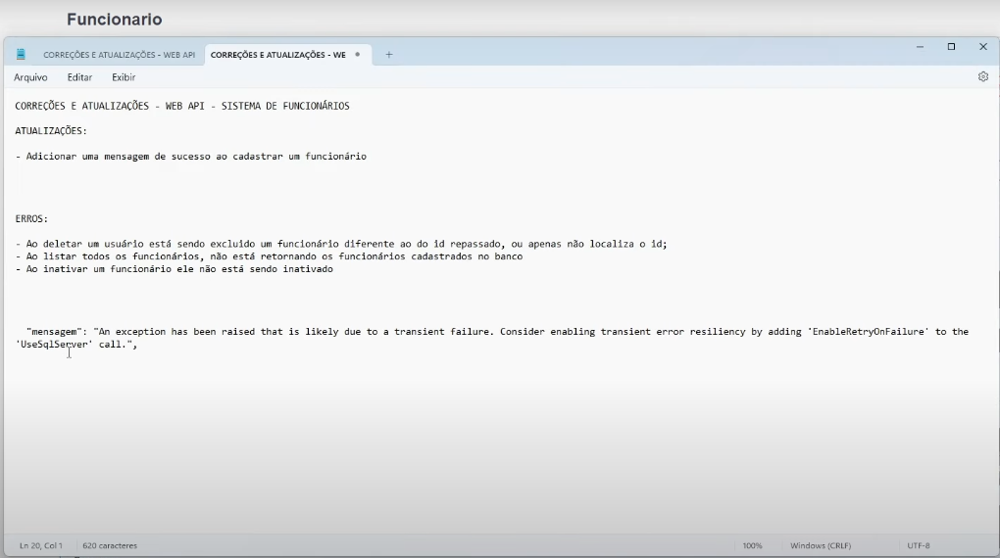

# .Net - Bug desafio 

### - Resolvi o ERRO 2 primeiro, antes do ERRO 1, motivo :
Abordei a técnica de alavancagem, "Tarefa habilitadora" (enabler task), métodologia que você ao resolver um problema agiliza a produção de resolver os outros em sequência.

### Conclusão :
Obviamente eu tenho condições resolver coisas muito mais complexas, apesar das pegadinhas, mas desafios sempre são bem vindos e interessantes.