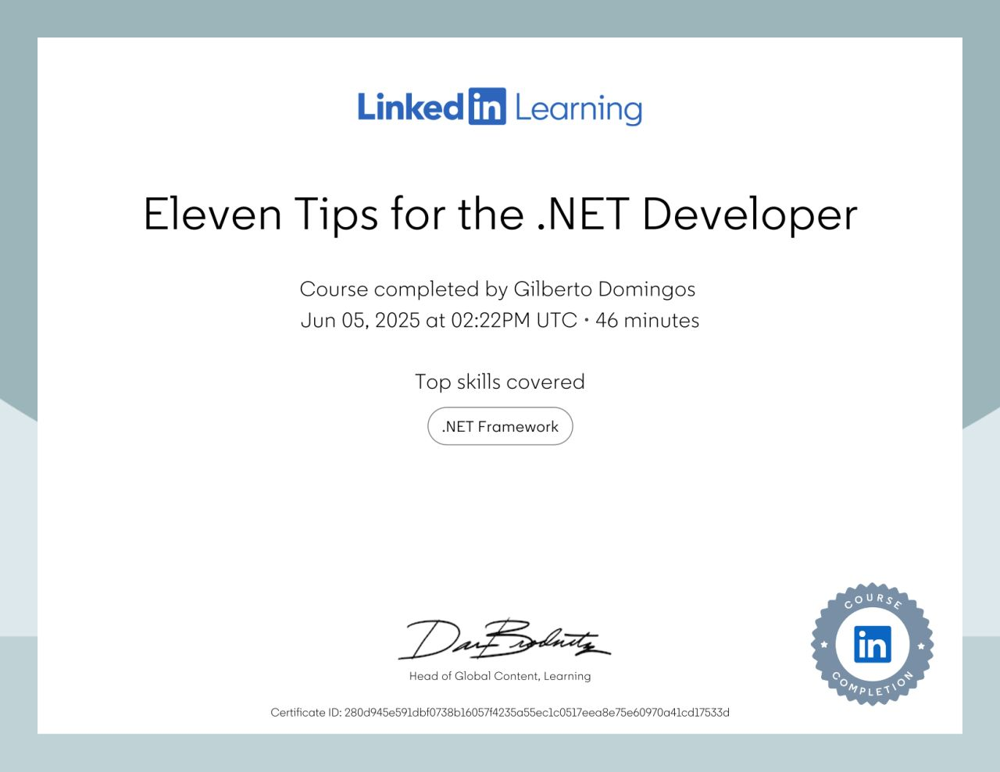

# 11 Dicas para desenvolvedores .NET

###### Walt Ritscher que é um Senior Staff Instructor disse : "Mesmo que você seja desenvolvedor há muito tempo, ainda existem recursos que você não usou ou não conhece."

##### Deu 11 dicas e novas bibliotecas entre elas uma que humaniza sua saída de strings e outra que gera dados falsos para testes de aplicativos e sistemas. São 11 branchs uma para cada lição. ("TipsConsole" e "DataLib")

Dicas :

- 1 => como publicar seu aplicativo .Net como um unico arquivo para fornecer a seus usuários, eles podem executar e
  conterá todo conteúdo, informações, tempo de execução do .NET e biblicotecas do .NET, (a maioria tem problemas quando
  usa bibliotecas externas).

- 2 => Flatten sequence with LINQ Select Many - Nivelar coleções e subcoleções em sua própria sequência.

- 3 => Use the Immutable List Collection - Muito melhor que DateTimeExtensions use TimeOnly e DateOnly, na implantação
  de arquivo único, SelectMany, DateOnly, Humanizer, ReadOnlyCollection. Combine, dados de teste falsos com Bogus,
  adição de endpoints de versão, contagem de caracteres de string Unicode, ToLookup e arquivos Zip.

- 4 => Humanize, for human readable strings - Pega strings de entidades programáticas e formata em um formato mais
  legível por humanos, instale os pacotes de acordo com o tipo de seu projeto. Agilidade de desenvolvimento para essas
  situações.

- 5 => Return readonly collection with asReadOnly - se quiser impedir que seja adicionado itens a lista, impedindo que o
  consumidor do objeto modifique diretamente a lista, ou seja, não será possível adicionar, remover ou modificar
  elementos via a interface da coleção retornada. "Esse padrão é útil para encapsulamento e proteção do estado interno
  de objetos, principalmente em APIs públicas,
  seguindo os princípios de imutabilidade e encapsulamento da POO."

- 6 => Build Linux and Windows path strings - Independente o sistema operacional, lide com problemas de paths de forma
  muito prática.

- 7 => Create fake test data, Bogus, AutoBogus library - privacidade e segurança use geração de dados falsos para fazer
  testes.

- 8 => Version endpoint for web api - Determine qual versão está implantada em um servidor ou servidor de teste para a
  verificação dos representantes de suporte ao cliente e as equipes de desenvolvimento ou testes para depuração e
  solução de problemas.

- 9 => Count Unicod Chars corretly in strings - Obtenção de caracteres inidividuais ou coleções, parece um tarefa
  simples exceto que, estamos trabalhando com caracteres Unicode e as vezes não é o que você espera.

- 10 => Shared key values with LINQ .ToLookup - Um dos operadores menos conhecidos do LINQ (.ToLookup), um dos
  benefícios é que ele é imutável, outro benefício que é o mais útil suporta chaves nulas e não lançará exceção, caso
  seja uma situação específica que você precise.

- 11 => Create zip arquive file - Segundo Walt Ritscher um dos desenvolvedores perguntou : "Qual pacote NuGet você usa
  para fazer arquivos .zip ?", então há uma biblioteca de compactação interna no .Net, caso você não tenha visto e como
  fazer, System.IO.Compression.

********

# 11 Tips for .NET Developers

This is the repository for the LinkedIn Learning course 11 Tips for .NET Developers. The full course is available
from LinkedIn Learning.

Microsoft .NET is equipped with so many libraries and APIs that sometimes it’s hard to keep track of it all. Even if
you’ve been a .NET developer for years, you probably still encounter features that you didn’t know were there. Now’s the
time to get your skills up to speed in this approachable course with instructor Walt Ritscher, exploring eleven key
coding tips to boost your know-how in .NET 6.

Ramp up your developer skills today to improve your performance or land a new job. Learn the most essential, easy-to-use
tricks to get the most out of the .NET experience, including single file deployment, SelectMany, DateOnly, Humanizer,
ReadOnlyCollection, .Combine, fake test data with Bogus, adding version endpoints, counting Unicode string characters,
ToLookup, and Zip files. Upon completing this course, you’ll be ready to tackle your next .NET coding challenge more
efficiently, quickly, and with ease.

## Instructions

This repository contains example code for each of the videos in the coursem organized into branches.

You can use the branch pop up menu in github to switch to a specific branch and view the code at that stage of the
course. Alternatively, you can directly access a specific branch by adding `/tree/BRANCH_NAME` to the URL.

# Branches in Visual Studio

While following along with the course, you can use Visual Studio's Git tools to switch between branches. This allows you
to easily move to the relevant chapter and topic as you progress through the course.

## Branches

The branches are structured to correspond to the videos in the course. The naming convention is `Tip#`.

When switching from one exercise files branch to the next after making changes to the files, you may get a message like
this:

    error: Your local changes to the following files would be overwritten by checkout:        [files]
    Please commit your changes or stash them before you switch branches.
    Aborting

To resolve this issue:

    Add changes to git using this command: git add .
	Commit changes using this command: git commit -m "some message"

## Installing

To use these exercise files, follow the instructions in the course to learn how to work with GitHub content.
For this course the instructor uses Visual Studio, any edition or version is sufficient (Community, Professional,
Enterprise).

## About our .NET courses

When you are ready to [learn more about .NET](https://www.linkedin.com/learning/search?entityType=COURSE&keywords=.net)
or [Visual Studio](https://www.linkedin.com/learning/search?entityType=COURSE&keywords=visual%20studio), **LinkedIn
Learning** has what you need.

## About the Instructor - Walt Ritscher

Learn-it Labs is a boutique video training company based in the Seattle area. Founded by Walt Ritscher, a long-time
LinkedIn Learning staff instructor, Learn-it Labs is dedicated to creating world-class, video-based courses on a wide
range of technology topics.

Follow on [LinkedIn](https://www.linkedin.com/in/waltritscher/?trk=lil_course).

[lil-course-url]: https://www.linkedin.com/learning/eleven-tips-for-the-dot-net-developer/

[lil-thumbnail-url]: https://cdn.lynda.com/course/2486135/2486135-1655838671011-16x9.jpg
